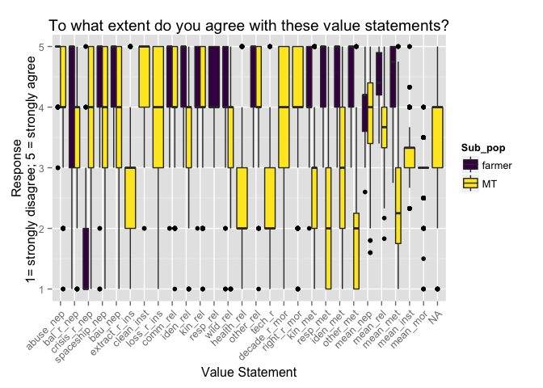
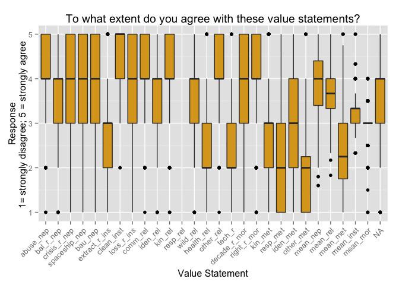
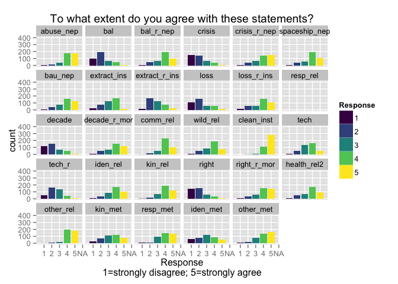
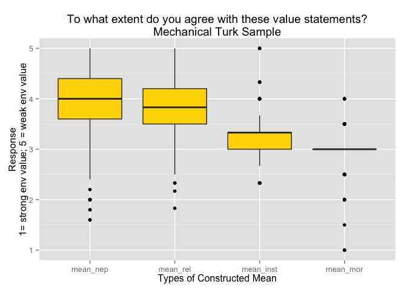
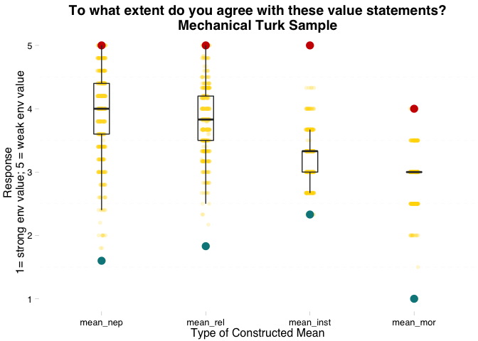
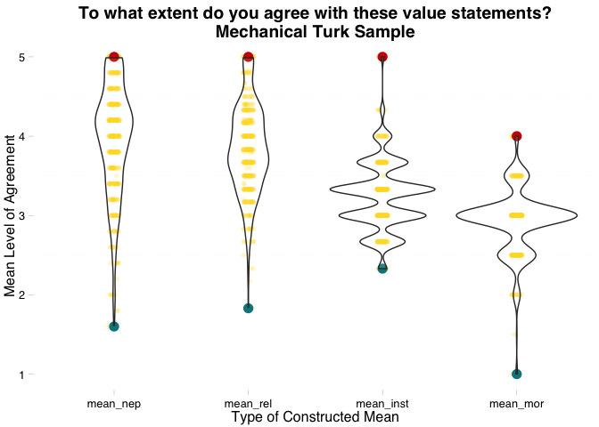
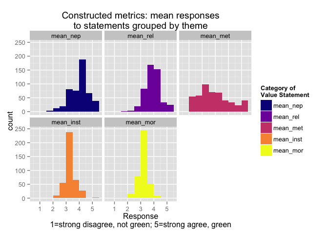
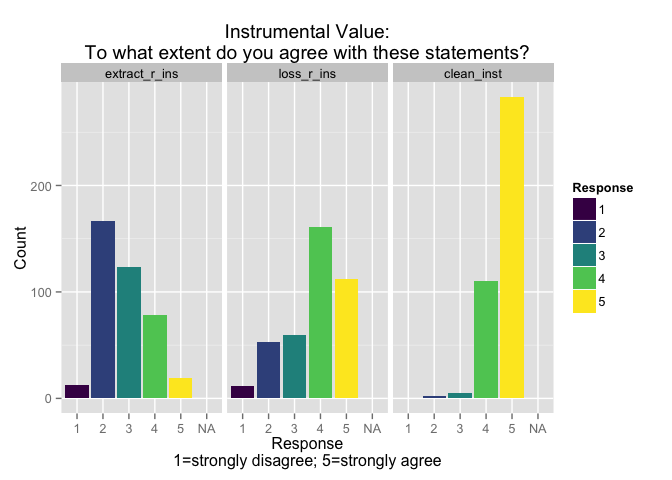

# Value_statements
Sarah Klain  
October 21, 2015  


Setup


```r
library(ggplot2)
library(ggthemes)
library(wesanderson)
library(viridis)
suppressMessages(library(dplyr))
library(knitr)
library(tidyr)
library(broom)
```

## Constructed Means

Input data

```r
cm <- read.csv("~/Documents/R_2015/wf_ce/Constr_means_MT.csv")
cval <- read.csv("Coded_val_10_20_2015.csv")
```

str(cval)
head(cval)
I did exploratory plots of the data


```r
cval2 <- tidyr::gather(cval, "val_state", "ag_dis", 3:30)
```

```
## Warning: attributes are not identical across measure variables; they will
## be dropped
```

```r
cval2$ag_dis2 <- as.numeric(cval2$ag_dis) 
```

```
## Warning: NAs introduced by coercion
```

```r
cval2$val_state2 <- factor(cval2$val_state, levels=c("abuse_nep","bal_r_nep", "crisis_r_nep", "spaceship_nep", "bau_nep", "extract_r_ins", "clean_inst", "loss_r_ins", "comm_rel", "iden_rel", "kin_rel","resp_rel","wild_rel", "health_rel", "other_rel", "tech_r",  "decade_r_mor","right_r_mor",  "kin_met", "resp_met", "iden_met", "other_met", "mean_nep", "mean_rel", "mean_met", "mean_inst", "mean_mor"))
```
str(cval2)
head(cval2)
View(cval2)

Both MT & farmers


```r
ggplot(cval2, aes(x = val_state2, y = ag_dis2, fill = Sub_pop)) +
 geom_boxplot(width=1) +
 theme(axis.text.x = element_text(angle = 45, hjust = 1)) +
  xlab("Value Statement") + ylab("Response\n1= strongly disagree; 5 = strongly agree ") +
  scale_fill_viridis(discrete=TRUE) +
  ggtitle("To what extent do you agree with these value statements?")
```

```
## Warning: Removed 2602 rows containing non-finite values (stat_boxplot).
```

 

```r
ggsave("fig_all_val_st_box.pdf")
```

```
## Saving 7 x 5 in image
```

```
## Warning: Removed 2602 rows containing non-finite values (stat_boxplot).
```


```r
ctbl <- cval2 %>%
  tbl_df

c_MT <- ctbl %>% 
  filter(Sub_pop == "MT")
  
ggplot(c_MT, aes(x = val_state2, y = ag_dis2)) +
 geom_boxplot(width=1, fill = "goldenrod" ) +
 theme(axis.text.x = element_text(angle = 45, hjust = 1)) +
  xlab("Value Statement") + ylab("Response\n1= strongly disagree; 5 = strongly agree ") +
  scale_fill_viridis(discrete=TRUE) +
  ggtitle("To what extent do you agree with these value statements?")
```

```
## Warning: Removed 414 rows containing non-finite values (stat_boxplot).
```

 

```r
ggsave("fig_MT_val_st_box.pdf")
```

```
## Saving 7 x 5 in image
```

```
## Warning: Removed 414 rows containing non-finite values (stat_boxplot).
```

str(c_MT)

View(c_MT$ag_dis_f)
summary(c_MT$ag_dis_f)
View(c_MT_vs)

Bar chart, all questions except means

```r
c_MT_vs <- c_MT %>% 
  filter(val_state2 != "mean_nep" & val_state2 != "mean_rel" & val_state2 != "mean_inst" & val_state2 != "mean_mor"& val_state2 != "mean_met")

ggplot(c_MT_vs, aes(x = ag_dis, fill = ag_dis)) +
  geom_histogram() +
  scale_fill_viridis(discrete=TRUE) +
  xlab("Response\n1=strong disagree, not green; 5=strong agree, green") +
  ggtitle("To what extent do you agree with these value statements?") + facet_wrap(~val_state2)
```

 

c_MT_vs <- c_MT %>% 
  filter(val_state2 == "mean_nep" | val_state2 != "mean_rel" & val_state2 != "mean_inst" & val_state2 != "mean_mor"& val_state2 != "mean_met")

ggplot(c_MT_vs, aes(x = ag_dis, fill = ag_dis)) +
  geom_histogram() +
  scale_fill_viridis(discrete=TRUE) +
  xlab("Response\n1=strong disagree, not green; 5=strong agree, green") +
  ggtitle("To what extent do you agree with these value statements?") + facet_wrap(~val_state2)


```r
ggplot(cval2, aes(x = val_state, y = ag_dis2, color = Sub_pop)) +
 geom_jitter(alpha = 0.1) +
 theme(axis.text.x = element_text(angle = 45, hjust = 1)) +
  xlab("Value Statement") + ylab("Response\n1= weak env value; 5 = strong env value") +
  scale_fill_viridis(discrete=TRUE) +
  scale_color_viridis(discrete=TRUE) +
  ggtitle("To what extent do you agree with these value statements?\n yellow = MT; blue = farmer") +
  theme_pander()
```

```
## Warning: Removed 2602 rows containing missing values (geom_point).
```

 

```r
ggsave("fig_all_val_st_dot.pdf")
```

```
## Saving 7 x 5 in image
```

```
## Warning: Removed 2602 rows containing missing values (geom_point).
```


```r
c_MT_means <- c_MT <- ctbl %>% 
  filter(val_state2 == "mean_nep" | val_state2 == "mean_rel" | val_state2 == "mean_inst" | val_state2 == "mean_mor" )

ggplot(c_MT_means, aes(x = ag_dis2, fill = val_state2)) +
  geom_histogram(binwidth =.5) +
  scale_fill_viridis(discrete=TRUE) +
  xlab("Response\n1=strong disagree, not green; 5=strong agree, green") +
  ggtitle("Constructed Metrics: Mean responses to statements grouped by theme") + facet_wrap(~val_state2)
```

 

```r
ggsave("fig_mean_val_st_bar.pdf")
```

```
## Saving 7 x 5 in image
```


```r
ggplot(c_MT_means, aes(x = val_state2, y = ag_dis2, fill = val_state2)) +
 geom_boxplot(binwidth = 0.5) +
  xlab("Types of Constructed Mean") + ylab("Response\n1= strong env value; 5 = weak env value") +
  scale_fill_viridis(discrete=TRUE) +
  ggtitle("To what extent do you agree with these value statements?\nMechanical Turk Sample")
```

```
## Warning: Removed 362 rows containing non-finite values (stat_boxplot).
```

 

```r
ggsave("fig_MT_mean_val_st_box.pdf")
```

```
## Saving 7 x 5 in image
```

```
## Warning: Removed 362 rows containing non-finite values (stat_boxplot).
```


```r
ggplot(c_MT_means, aes(x = val_state2, y = ag_dis2)) +
  geom_jitter(position = position_jitter(width = 0.04, height = 0), color = "gold", alpha = 1/5) +
  stat_summary(fun.y = min, colour = "turquoise4", geom = "point", size = 4) +
  stat_summary(fun.y = max, colour = "red3", geom = "point", size = 4) +
  geom_boxplot(width=.2, outlier.shape = NA, alpha = 0.1) +
  xlab("Type of Constructed Mean") + ylab("Response\n1= weak env value; 5 = strong env value") +
  ggtitle("To what extent do you agree with these value statements?\nMechanical Turk Sample")  +
  theme_pander()
```

```
## Warning: Removed 362 rows containing missing values (stat_summary).
```

```
## Warning: Removed 362 rows containing missing values (stat_summary).
```

```
## Warning: Removed 362 rows containing non-finite values (stat_boxplot).
```

```
## Warning: Removed 362 rows containing missing values (geom_point).
```

```
## Warning: Removed 11 rows containing missing values (geom_point).
```

```
## Warning: Removed 4 rows containing missing values (geom_point).
```

```
## Warning: Removed 41 rows containing missing values (geom_point).
```

```
## Warning: Removed 154 rows containing missing values (geom_point).
```

 

```r
# ggsave(file = "~/Users/sarahklain/Documents/R_2015/wf_ce/figs/test.pdf")
```

And a squiggly violin plot! 


```r
ggplot(c_MT_means, aes(x = val_state2, y = ag_dis2), fill = val_state2) +
  geom_jitter(position = position_jitter(width = 0.04, height = 0), color = "gold", alpha = 0.05) +
  stat_summary(fun.y = min, colour = "turquoise4", geom = "point", size = 4) +
  stat_summary(fun.y = max, colour = "red3", geom = "point", size = 4) +
  geom_violin(alpha = 0.01) +
  scale_fill_viridis(discrete=TRUE) +
  xlab("Type of Constructed Mean") + ylab("Mean Level of Agreement") +
  ggtitle("To what extent do you agree with these value statements?\nMechanical Turk Sample") +
  theme_pander()
```

```
## Warning: Removed 362 rows containing missing values (stat_summary).
```

```
## Warning: Removed 362 rows containing missing values (stat_summary).
```

```
## Warning: Removed 362 rows containing non-finite values (stat_ydensity).
```

```
## Warning: Removed 362 rows containing missing values (geom_point).
```

 

```r
ggsave("fig_MT_mean_val_st_jit_vio.pdf")
```

```
## Saving 7 x 5 in image
```

```
## Warning: Removed 362 rows containing missing values (stat_summary).
```

```
## Warning: Removed 362 rows containing missing values (stat_summary).
```

```
## Warning: Removed 362 rows containing non-finite values (stat_ydensity).
```

```
## Warning: Removed 362 rows containing missing values (geom_point).
```
