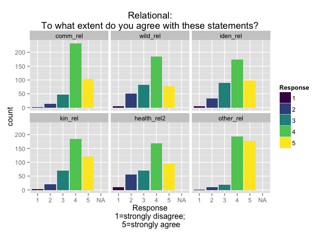
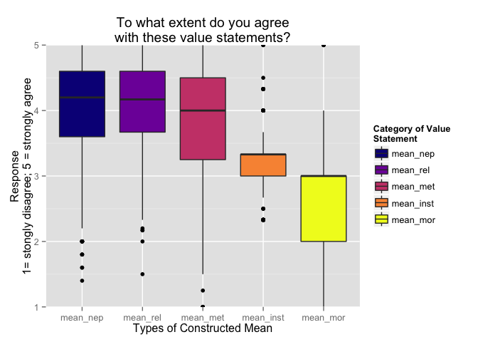

# Value_statements
Sarah Klain  
October 21, 2015  


Setup


```r
library(ggplot2)
library(ggthemes)
library(wesanderson)
library(viridis)
suppressMessages(library(dplyr))
library(knitr)
library(tidyr)
library(broom)
```

## Constructed Means

Input data

```r
cm <- read.csv("~/Documents/R_2015/wf_ce/Constr_means_MT.csv")
cval <- read.csv("Coded_val_10_20_2015.csv")
```

str(cval)
head(cval)
I did exploratory plots of the data


```r
cval2 <- tidyr::gather(cval, "val_state", "ag_dis", 3:30)
```

```
## Warning: attributes are not identical across measure variables; they will
## be dropped
```

```r
cval2$ag_dis2 <- as.numeric(cval2$ag_dis) 
```

```
## Warning: NAs introduced by coercion
```

```r
cval2$val_state2 <- factor(cval2$val_state, levels=c("abuse_nep","bal_r_nep", "crisis_r_nep", "spaceship_nep", "bau_nep", "extract_r_ins", "clean_inst", "loss_r_ins", "comm_rel", "iden_rel", "kin_rel","resp_rel","wild_rel", "health_rel", "other_rel", "tech_r",  "decade_r_mor","right_r_mor",  "kin_met", "resp_met", "iden_met", "other_met", "mean_nep", "mean_rel", "mean_met", "mean_inst", "mean_mor"))
```
str(cval2)
head(cval2)
View(cval2)

Both MT & farmers


```r
#ggplot(cval2, aes(x = val_state2, y = ag_dis2, fill = Sub_pop)) +
# geom_boxplot(width=1) +
# theme(axis.text.x = element_text(angle = 45, hjust = 1)) +
#  xlab("Value Statement") + ylab("Response\n1= strongly disagree; 5 = strongly agree ") +
#  scale_fill_viridis(discrete=TRUE) +
#  ggtitle("To what extent do you agree with these value statements?")
  
#ggsave("fig_all_val_st_box.pdf")
```


```r
ctbl <- cval2 %>%
  tbl_df

c_MT <- ctbl %>% 
  filter(Sub_pop == "MT")
```

Bar chart, all value statements except means


```r
c_MT_vs <- c_MT %>% 
  filter(val_state2 != "mean_nep" & val_state2 != "mean_rel" & val_state2 != "mean_inst" & val_state2 != "mean_mor"& val_state2 != "mean_met")

no_means_bar <- ggplot(c_MT_vs, aes(x = ag_dis, fill = ag_dis)) +
  geom_histogram() +
  scale_fill_viridis(discrete=TRUE) +
  xlab("Response\n1=strong disagree, not green; 5=strong agree, green") +
  ggtitle("To what extent do you agree with these value statements?") + facet_wrap(~val_state2)

no_means_bar
```

 

```r
ggsave(no_means_bar, file="/Users/sarahklain/Documents/R_2015/wf_ce/figs/no_means_bar.pdf")
```

```
## Saving 7 x 5 in image
```

NEP


```r
c_MT_vs_nep <- c_MT %>% 
  filter(val_state2 == "abuse_nep" | val_state2 == "bal_r_nep" | val_state2 == "crisis_r_nep" | val_state2 == "bau_nep")

NEP_bar <- ggplot(c_MT_vs_nep, aes(x = ag_dis, fill = ag_dis)) +
  geom_histogram() +
  scale_fill_viridis(discrete=TRUE) +
  xlab("Response\n1=strong disagree, not enviro; 5=strong agree, enviro") +
  ggtitle("NEP: To what extent do you agree \nwith these value statements?") + facet_wrap(~val_state2)

c_MT_vs_nep
```

```
## Source: local data frame [1,600 x 6]
## 
##           ResponseID Sub_pop val_state ag_dis ag_dis2 val_state2
##               (fctr)  (fctr)    (fctr)  (chr)   (dbl)     (fctr)
## 1  R_3vIN0Gt4GOykklL      MT abuse_nep      4       4  abuse_nep
## 2  R_8IL64Ln8taMW3JP      MT abuse_nep      5       5  abuse_nep
## 3  R_b8wu6cwP3lxBOJv      MT abuse_nep      3       3  abuse_nep
## 4  R_el22tcAF8oylTmJ      MT abuse_nep      5       5  abuse_nep
## 5  R_3BHxg7xEcXZrZMF      MT abuse_nep      4       4  abuse_nep
## 6  R_3IqlfNx2hfYxxnD      MT abuse_nep      5       5  abuse_nep
## 7  R_40XchjhEy0nAmxL      MT abuse_nep      4       4  abuse_nep
## 8  R_cRV5ic7cdPwDd1X      MT abuse_nep      1       1  abuse_nep
## 9  R_78tNW32zHdAnvI9      MT abuse_nep      5       5  abuse_nep
## 10 R_9B2xLMemFgPDDal      MT abuse_nep      4       4  abuse_nep
## ..               ...     ...       ...    ...     ...        ...
```

```r
ggsave(NEP_bar, file="/Users/sarahklain/Documents/R_2015/wf_ce/figs/NEP_bar.pdf")
```

```
## Saving 7 x 5 in image
```

Relational


```r
c_MT_vs_rel <- c_MT %>% 
  filter(val_state2 == "comm_rel" | val_state2 == "iden_rel" | val_state2 == "kin_rel" | val_state2 == "wild_rel" | val_state2 == "health_rel" | val_state2 == "other_rel" )

rel_bar <- ggplot(c_MT_vs_rel, aes(x = ag_dis, fill = ag_dis)) +
  geom_histogram() +
  scale_fill_viridis(discrete=TRUE, "Relational") +
  xlab("Response\n1=strong disagree, not enviro; 5=strong agree, enviro") +
  ggtitle("Relational: To what extent do you agree \nwith these value statements?") + facet_wrap(~val_state2)

rel_bar
```

 

```r
ggsave(rel_bar, file="/Users/sarahklain/Documents/R_2015/wf_ce/figs/rel_bar.pdf")
```

```
## Saving 7 x 5 in image
```

dot plot 


```r
all_val_st_dot <- ggplot(cval2, aes(x = val_state, y = ag_dis2, color = Sub_pop)) +
 geom_jitter(alpha = 0.1) +
 theme(axis.text.x = element_text(angle = 45, hjust = 1)) +
  xlab("Value Statement") + ylab("Response\n1= weak env value; 5 = strong env value") +
  scale_fill_viridis(discrete=TRUE) +
  scale_color_viridis(discrete=TRUE) +
  ggtitle("To what extent do you agree with these value statements?\n yellow = MT; blue = farmer") +
  theme_pander()

all_val_st_dot
```

```
## Warning: Removed 1314 rows containing missing values (geom_point).
```

 

```r
ggsave(all_val_st_dot, file="/Users/sarahklain/Documents/R_2015/wf_ce/figs/all_val_st_dot.pdf")
```

```
## Saving 7 x 5 in image
```

```
## Warning: Removed 1314 rows containing missing values (geom_point).
```
 
Constructed scores (means by aggregated categories)
 

```r
c_MT_means <- c_MT <- ctbl %>% 
  filter(val_state2 == "mean_nep" | val_state2 == "mean_rel" | val_state2 == "mean_inst" | val_state2 == "mean_mor" | val_state2 == "mean_met" )

means_hist <- ggplot(c_MT_means, aes(x = ag_dis2, fill = val_state2)) +
  geom_histogram(binwidth =.5) +
  scale_fill_viridis(discrete=TRUE, "Category of\nValue Statement", option = "plasma") +
  xlab("Response\n1=strong disagree, not green; 5=strong agree, green") +
  ggtitle("Constructed metrics: mean responses\nto statements grouped by theme") + facet_wrap(~val_state2)

means_hist
```

 

```r
ggsave(means_hist, file="/Users/sarahklain/Documents/R_2015/wf_ce/figs/means_hist.pdf")
```

```
## Saving 7 x 5 in image
```


```r
mean_val_st_box <- ggplot(c_MT_means, aes(x = val_state2, y = ag_dis2, fill = val_state2)) +
 geom_boxplot(binwidth = 0.5) +
  xlab("Types of Constructed Mean") + ylab("Response\n1= strong env value; 5 = weak env value") +
  scale_fill_viridis(discrete=TRUE, "Category of Value\nStatement", option = "plasma") +
  ggtitle("To what extent do you agree\nwith these value statements?")

mean_val_st_box
```

```
## Warning: Removed 179 rows containing non-finite values (stat_boxplot).
```

 

```r
ggsave(mean_val_st_box, file="/Users/sarahklain/Documents/R_2015/wf_ce/figs/mean_val_st_box.pdf") 
```

```
## Saving 7 x 5 in image
```

```
## Warning: Removed 179 rows containing non-finite values (stat_boxplot).
```


```r
box_dot_means <- ggplot(c_MT_means, aes(x = val_state2, y = ag_dis2)) +
  geom_jitter(position = position_jitter(width = 0.04, height = 0), color = "gold", alpha = 1/5) +
  stat_summary(fun.y = min, colour = "turquoise4", geom = "point", size = 4) +
  stat_summary(fun.y = max, colour = "red3", geom = "point", size = 4) +
  geom_boxplot(width=.2, outlier.shape = NA, alpha = 0.1) +
  xlab("Type of Constructed Mean") + ylab("Response\n1= weak env value; 5 = strong env value") +
  ggtitle("To what extent do you agree with these value statements?\nMechanical Turk Sample")  +
  theme_pander()

box_dot_means
```

```
## Warning: Removed 179 rows containing missing values (stat_summary).
```

```
## Warning: Removed 179 rows containing missing values (stat_summary).
```

```
## Warning: Removed 179 rows containing non-finite values (stat_boxplot).
```

```
## Warning: Removed 179 rows containing missing values (geom_point).
```

```
## Warning: Removed 11 rows containing missing values (geom_point).
```

```
## Warning: Removed 4 rows containing missing values (geom_point).
```

```
## Warning: Removed 41 rows containing missing values (geom_point).
```

```
## Warning: Removed 154 rows containing missing values (geom_point).
```

 

```r
ggsave(box_dot_means, file="/Users/sarahklain/Documents/R_2015/wf_ce/figs/box_dot_means.pdf") 
```

```
## Saving 7 x 5 in image
```

```
## Warning: Removed 179 rows containing missing values (stat_summary).
```

```
## Warning: Removed 179 rows containing missing values (stat_summary).
```

```
## Warning: Removed 179 rows containing non-finite values (stat_boxplot).
```

```
## Warning: Removed 179 rows containing missing values (geom_point).
```

```
## Warning: Removed 11 rows containing missing values (geom_point).
```

```
## Warning: Removed 4 rows containing missing values (geom_point).
```

```
## Warning: Removed 41 rows containing missing values (geom_point).
```

```
## Warning: Removed 154 rows containing missing values (geom_point).
```

And a squiggly violin plot! 


```r
dot_vio_means <- ggplot(c_MT_means, aes(x = val_state2, y = ag_dis2), fill = val_state2) +
  geom_jitter(position = position_jitter(width = 0.04, height = 0), color = "gold", alpha = 0.05) +
  stat_summary(fun.y = min, colour = "turquoise4", geom = "point", size = 4) +
  stat_summary(fun.y = max, colour = "red3", geom = "point", size = 4) +
  geom_violin(alpha = 0.01) +
  scale_fill_viridis(discrete=TRUE) +
  xlab("Type of Constructed Mean") + ylab("Mean Level of Agreement") +
  ggtitle("To what extent do you agree with these value statements?\nMechanical Turk Sample") +
  theme_pander()

dot_vio_means
```

```
## Warning: Removed 179 rows containing missing values (stat_summary).
```

```
## Warning: Removed 179 rows containing missing values (stat_summary).
```

```
## Warning: Removed 179 rows containing non-finite values (stat_ydensity).
```

```
## Warning: Removed 179 rows containing missing values (geom_point).
```

 

```r
ggsave(dot_vio_means, file="/Users/sarahklain/Documents/R_2015/wf_ce/figs/dot_vio_means.pdf")
```

```
## Saving 7 x 5 in image
```

```
## Warning: Removed 179 rows containing missing values (stat_summary).
```

```
## Warning: Removed 179 rows containing missing values (stat_summary).
```

```
## Warning: Removed 179 rows containing non-finite values (stat_ydensity).
```

```
## Warning: Removed 179 rows containing missing values (geom_point).
```

Linear Models

Mean NEP and mean relational 


```r
ctbl <- cval %>%
  tbl_df

cMT <- cval %>% 
  filter(Sub_pop == "MT")


lm_nep_rel <- lm(cMT$mean_nep ~ cMT$mean_rel)
summary(lm_nep_rel)
```

```
## 
## Call:
## lm(formula = cMT$mean_nep ~ cMT$mean_rel)
## 
## Residuals:
##     Min      1Q  Median      3Q     Max 
## -2.3944 -0.3658  0.1074  0.4905  1.5269 
## 
## Coefficients:
##              Estimate Std. Error t value Pr(>|t|)    
## (Intercept)   1.39506    0.25707   5.427 9.99e-08 ***
## cMT$mean_rel  0.69268    0.06883  10.063  < 2e-16 ***
## ---
## Signif. codes:  0 '***' 0.001 '**' 0.01 '*' 0.05 '.' 0.1 ' ' 1
## 
## Residual standard error: 0.6649 on 398 degrees of freedom
## Multiple R-squared:  0.2028,	Adjusted R-squared:  0.2008 
## F-statistic: 101.3 on 1 and 398 DF,  p-value: < 2.2e-16
```

```r
coef(lm(cMT$mean_nep ~ cMT$mean_rel))
```

```
##  (Intercept) cMT$mean_rel 
##    1.3950615    0.6926811
```

```r
nep_rel_pt <- ggplot(cMT, aes(x = mean_nep, y = mean_rel)) +
  geom_point(alpha = 0.5) +
  scale_color_viridis(discrete=TRUE) +
  geom_abline(intercept = 1.3950615, slope = 0.6926811, color = "orange") +
  ggtitle("NEP vs Relational Scores for MT") +
  theme_few() +
  xlab("NEP") + ylab("Relational Constructed Metric")
  
nep_rel_pt 
```

 

```r
ggsave(nep_rel_pt, file="/Users/sarahklain/Documents/R_2015/wf_ce/figs/nep_rel_pt.pdf")
```

```
## Saving 7 x 5 in image
```

Instrumental and moral


```r
#cval$mean_mor_num <- as.numeric(cval$mean_mor)
#cval$mean_inst_num <- as.numeric(cval$mean_inst)


lm_inst_mor <- lm(cMT$mean_inst ~ cMT$mean_mor)
summary(lm_inst_mor)
```

```
## 
## Call:
## lm(formula = cMT$mean_inst ~ cMT$mean_mor)
## 
## Residuals:
##      Min       1Q   Median       3Q      Max 
## -0.94353 -0.23623  0.05647  0.13107  1.80107 
## 
## Coefficients:
##              Estimate Std. Error t value Pr(>|t|)    
## (Intercept)   3.46003    0.15721  22.010   <2e-16 ***
## cMT$mean_mor -0.07460    0.05315  -1.404    0.161    
## ---
## Signif. codes:  0 '***' 0.001 '**' 0.01 '*' 0.05 '.' 0.1 ' ' 1
## 
## Residual standard error: 0.4303 on 398 degrees of freedom
## Multiple R-squared:  0.004926,	Adjusted R-squared:  0.002426 
## F-statistic:  1.97 on 1 and 398 DF,  p-value: 0.1612
```

```r
coef(lm_inst_mor)
```

```
##  (Intercept) cMT$mean_mor 
##   3.46003319  -0.07460177
```

```r
ggplot(cMT, aes(x = mean_mor, y = mean_inst)) +
  geom_point(alpha = 0.25, color = "#330033") +
  geom_abline(intercept = 3.46003319, slope = -0.07460177, color = "#CC0000") +
  xlab("Moral Constructed Metric") + ylab("Instrumental Constructed Metric") +
  theme_few()
```

 


```r
lm_inst_rel <- lm(cMT$mean_inst ~ cMT$mean_rel)
summary(lm_inst_rel)
```

```
## 
## Call:
## lm(formula = cMT$mean_inst ~ cMT$mean_rel)
## 
## Residuals:
##      Min       1Q   Median       3Q      Max 
## -0.97497 -0.25155  0.06489  0.17093  1.77476 
## 
## Coefficients:
##              Estimate Std. Error t value Pr(>|t|)    
## (Intercept)   2.94621    0.16611  17.737   <2e-16 ***
## cMT$mean_rel  0.07972    0.04448   1.792   0.0738 .  
## ---
## Signif. codes:  0 '***' 0.001 '**' 0.01 '*' 0.05 '.' 0.1 ' ' 1
## 
## Residual standard error: 0.4296 on 398 degrees of freedom
## Multiple R-squared:  0.008008,	Adjusted R-squared:  0.005515 
## F-statistic: 3.213 on 1 and 398 DF,  p-value: 0.07382
```

```r
coef(lm_inst_rel)
```

```
##  (Intercept) cMT$mean_rel 
##   2.94621051   0.07972389
```


```r
lm_nep_mor <- lm(cMT$mean_nep ~ cMT$mean_mor)
summary(lm_nep_mor)
```

```
## 
## Call:
## lm(formula = cMT$mean_nep ~ cMT$mean_mor)
## 
## Residuals:
##      Min       1Q   Median       3Q      Max 
## -2.35746 -0.53752  0.06248  0.46248  1.06248 
## 
## Coefficients:
##              Estimate Std. Error t value Pr(>|t|)    
## (Intercept)   4.07707    0.27200  14.989   <2e-16 ***
## cMT$mean_mor -0.03987    0.09196  -0.434    0.665    
## ---
## Signif. codes:  0 '***' 0.001 '**' 0.01 '*' 0.05 '.' 0.1 ' ' 1
## 
## Residual standard error: 0.7445 on 398 degrees of freedom
## Multiple R-squared:  0.000472,	Adjusted R-squared:  -0.002039 
## F-statistic: 0.188 on 1 and 398 DF,  p-value: 0.6649
```

```r
coef(lm_inst_mor)
```

```
##  (Intercept) cMT$mean_mor 
##   3.46003319  -0.07460177
```


```r
lm_met_rel <- lm(cMT$mean_met ~ cMT$mean_rel)
summary(lm_met_rel)
```

```
## 
## Call:
## lm(formula = cMT$mean_met ~ cMT$mean_rel)
## 
## Residuals:
##     Min      1Q  Median      3Q     Max 
## -1.8122 -0.4308 -0.0140  0.4115  3.4027 
## 
## Coefficients:
##              Estimate Std. Error t value Pr(>|t|)    
## (Intercept)   7.06535    0.24181   29.22   <2e-16 ***
## cMT$mean_rel -1.26283    0.06475  -19.50   <2e-16 ***
## ---
## Signif. codes:  0 '***' 0.001 '**' 0.01 '*' 0.05 '.' 0.1 ' ' 1
## 
## Residual standard error: 0.6254 on 398 degrees of freedom
## Multiple R-squared:  0.4887,	Adjusted R-squared:  0.4874 
## F-statistic: 380.4 on 1 and 398 DF,  p-value: < 2.2e-16
```

```r
coef(lm_met_rel)
```

```
##  (Intercept) cMT$mean_rel 
##     7.065353    -1.262829
```

```r
ggplot(cMT, aes(x = mean_met, y = mean_rel)) +
  geom_point(alpha = 0.25, color = "#330033") +
  geom_abline(intercept = 7.065353, slope = -1.262829, color = "#CC0000") +
  xlab("Metaphor Constructed Metric") + ylab("Relational Constructed Metric") +
  theme_few()
```

 
