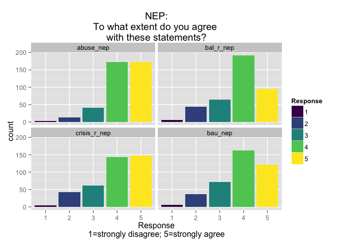
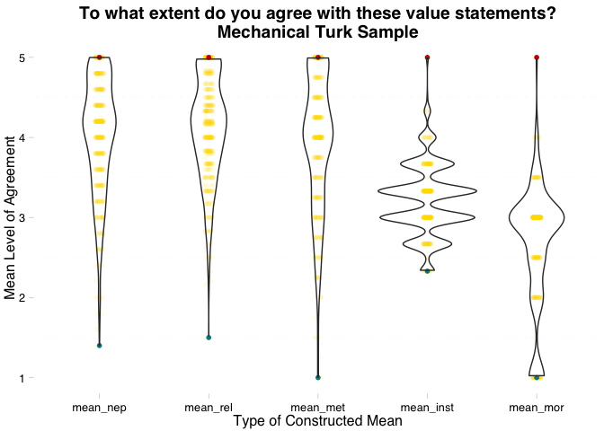

# Value_statements
Sarah Klain  
October 21, 2015  


Setup


```r
library(ggplot2)
library(ggthemes)
library(viridis)
suppressMessages(library(dplyr))
library(knitr)
library(tidyr)
library(broom)
```

## Constructed Means

Input data

```r
setwd("/Users/sarahklain/Documents/R_2015/wf_ce")
#cm <- read.csv("Constr_means_MT.csv")
cval <- read.csv("env_val/EnVal_subgroups_10_26_2015.csv")
```

str(cval)
head(cval)
I did exploratory plots of the data


```r
cval2 <- tidyr::gather(cval, "val_state", "response", 3:38)
cval2$response_f <- as.factor(cval2$response)

#cval2$val_state <- factor(cval2$val_state, levels=c("abuse_nep","bal_r_nep", "crisis_r_nep", "spaceship_nep", "bau_nep", "extract_r_ins", "clean_inst", "loss_r_ins", "comm_rel", "iden_rel", "kin_rel","resp_rel","wild_rel", "health_rel2", "other_rel", "tech_r",  "decade_r_mor","right_r_mor",  "kin_met", "resp_met", "iden_met", "other_met", "mean_nep", "mean_rel", "mean_met", "mean_inst", "mean_mor"))
```
str(cval2)
head(cval2)
View(cval2)

Both MT & farmers


```r
#ggplot(cval2, aes(x = val_state, y = ag_dis2, fill = Sub_pop)) +
# geom_boxplot(width=1) +
# theme(axis.text.x = element_text(angle = 45, hjust = 1)) +
#  xlab("Value Statement") + ylab("Response\n1= strongly disagree; 5 = strongly agree ") +
#  scale_fill_viridis(discrete=TRUE) +
#  ggtitle("To what extent do you agree with these value statements?")
  
#ggsave("fig_all_val_st_box.pdf")
```


```r
ctbl <- cval2 %>%
  tbl_df

c_MT <- ctbl %>% 
  filter(Sub_pop == "MT")
```

Bar chart, all value statements except means


```r
c_MT_vs <- c_MT %>% 
  filter(val_state != "mean_nep" & val_state != "mean_rel" & val_state != "mean_inst" & val_state != "mean_mor" & val_state != "mean_met" & val_state != "health_r_rel" & val_state != "health_rel")

no_means_bar <- ggplot(c_MT_vs, aes(x = response_f, fill = response_f)) +
  geom_histogram(binwidth = 0.5) +
  scale_fill_viridis(discrete=TRUE, "Response") +
  xlab("Response\n1=strongly disagree; 5=strongly agree") +
  ggtitle("To what extent do you agree with these statements?") + 
  facet_wrap(~val_state) +
  coord_cartesian(xlim = c(0, 6)) 

no_means_bar
```

 

```r
ggsave(no_means_bar, file="/Users/sarahklain/Documents/R_2015/wf_ce/figs/no_means_bar.pdf")
```

```
## Saving 7 x 5 in image
```

NEP


```r
c_MT_vs_nep <- c_MT %>% 
  filter(val_state == "abuse_nep" | val_state == "bal_r_nep" | val_state == "crisis_r_nep" | val_state == "bau_nep")
  
NEP_bar <- ggplot(c_MT_vs_nep, aes(x = response_f, fill = response_f)) +
  geom_histogram(binwidth = 0.5) +
  scale_fill_viridis(discrete=TRUE, "Response") +
  xlab("Response\n1=strongly disagree; 5=strongly agree") +
  ggtitle("NEP:\nTo what extent do you agree \nwith these statements?") + facet_wrap(~val_state)

NEP_bar
```

 

```r
ggsave(NEP_bar, file="/Users/sarahklain/Documents/R_2015/wf_ce/figs/NEP_bar.pdf")
```

```
## Saving 7 x 5 in image
```

Metaphors


```r
c_MT_vs_met <- c_MT %>% 
  filter(val_state == "kin_met" | val_state == "resp_met" | val_state == "iden_met" | val_state == "other_met")

met_bar <- ggplot(c_MT_vs_met, aes(x = response_f, fill = response_f)) +
  geom_histogram() +
  scale_fill_viridis(discrete=TRUE, "Response") +
  xlab("Response\n1=Yes, this is very much like how I think about the ocean;\n5=No, this is very unlike how I think about the ocean") +
  ggtitle("Metaphor:\nI think about the ocean and\nthe plants and animals in it like...") +
  facet_wrap(~val_state)

met_bar
```

 

```r
ggsave(met_bar, file="/Users/sarahklain/Documents/R_2015/wf_ce/figs/met_bar.pdf")
```

```
## Saving 7 x 5 in image
```

Violin plots just for metaphors 


```r
dot_vio_met <- ggplot(c_MT_vs_met, aes(x = c_MT_vs_met$val_state, y = response, color =  c_MT_vs_met$val_state)) +
  geom_jitter(position = position_jitter(width = 0.1, height = 0.1), alpha = 0.2) +
  geom_violin(alpha = 0.01) +
  scale_color_viridis(discrete=TRUE, option = "plasma") +
  xlab("Metaphor") + ylab("Mean Level of Agreement") +
  ggtitle("Metaphor:\nI think about the ocean and\nthe plants and animals in it like...") +
  theme_pander()

dot_vio_met
```

```
## Warning: Removed 3 rows containing non-finite values (stat_ydensity).
```

```
## Warning: Removed 3 rows containing missing values (geom_point).
```

 

```r
ggsave(dot_vio_met, file="/Users/sarahklain/Documents/R_2015/wf_ce/figs/dot_vio_met.pdf")
```

```
## Saving 7 x 5 in image
```

```
## Warning: Removed 3 rows containing non-finite values (stat_ydensity).
```

```
## Warning: Removed 3 rows containing missing values (geom_point).
```

Relational


```r
c_MT_vs_rel <- c_MT %>% 
  filter(val_state == "comm_rel" | val_state == "iden_rel" | val_state == "kin_rel" | val_state == "wild_rel" | val_state == "health_rel2" | val_state == "other_rel" )
  
rel_bar <- ggplot(c_MT_vs_rel, aes(x = response_f, fill = response_f)) +
  geom_histogram() +
  scale_fill_viridis(discrete=TRUE, "Response") +
  xlab("Response\n1=strongly disagree;\n 5=strongly agree") +
  ggtitle("Relational:\nTo what extent do you agree with these statements?") + facet_wrap(~val_state)

rel_bar
```

 

```r
ggsave(rel_bar, file="/Users/sarahklain/Documents/R_2015/wf_ce/figs/rel_bar.pdf")
```

```
## Saving 7 x 5 in image
```

Instrumental

```r
c_MT_vs_ins <- c_MT %>% 
  filter(val_state == "extract_r_ins" | val_state == "clean_inst" | val_state == "loss_r_ins")

ins_bar <- ggplot(c_MT_vs_ins, aes(x = response_f, fill = response_f)) +
  geom_histogram() +
  scale_fill_viridis(discrete=TRUE, "Response") +
  xlab("Response\n1=strongly disagree; 5=strongly agree") +
  ylab("Count") +
  ggtitle("Instrumental Value:\nTo what extent do you agree with these statements?") + facet_wrap(~val_state)

ins_bar
```

 

```r
ggsave(ins_bar, file="/Users/sarahklain/Documents/R_2015/wf_ce/figs/ins_bar.pdf")
```

```
## Saving 7 x 5 in image
```

Moral


```r
c_MT_vs_mor <- c_MT %>% 
  filter(val_state == "decade_r_mor" | val_state == "right_r_mor")

mor_bar <- ggplot(c_MT_vs_mor, aes(x = response_f, fill = response_f)) +
  geom_histogram() +
  scale_fill_viridis(discrete=TRUE, "Response") +
  xlab("Response\n1=strongly disagree, not enviro; 5=strongly agree, enviro") +
  ggtitle("Moral:\nTo what extent do you agree with these statements?") + facet_wrap(~val_state)

mor_bar
```

 

```r
ggsave(mor_bar, file="/Users/sarahklain/Documents/R_2015/wf_ce/figs/mor_bar.pdf")
```

```
## Saving 7 x 5 in image
```
dot plot 


```r
 all_val_st_dot <- ggplot(cval2, aes(x = val_state, y = response, color = Sub_pop)) +
 geom_jitter(alpha = 0.01) +
 theme(axis.text.x = element_text(angle = 45, hjust = 1)) +
  xlab("Value Statement") + ylab("Response\n1= strongly disagree; 5 = strongly agree") +
  scale_fill_viridis(discrete=TRUE) +
  scale_color_viridis(discrete=TRUE) +
  ggtitle("To what extent do you agree with these statements?\n yellow = MT; blue = farmer") +
  theme_pander() +
  coord_cartesian(ylim = c(1, 5)) 

all_val_st_dot
```

```
## Warning: Removed 7436 rows containing missing values (geom_point).
```

 

```r
ggsave(all_val_st_dot, file="/Users/sarahklain/Documents/R_2015/wf_ce/figs/all_val_st_dot.pdf")
```

```
## Saving 7 x 5 in image
```

```
## Warning: Removed 7436 rows containing missing values (geom_point).
```

Constructed scores (means by aggregated categories)
 

```r
c_MT_means <- c_MT <- ctbl %>% 
  filter(val_state == "mean_nep" | val_state == "mean_rel" | val_state == "mean_inst" | val_state == "mean_mor" | val_state == "mean_met" )

means_hist <- ggplot(c_MT_means, aes(x = response, fill = val_state)) +
  geom_histogram(binwidth = 0.5) +
  scale_fill_viridis(discrete=TRUE, "Category of\nValue Statement", option = "plasma") +
  xlab("Response\n1=strongly disagree; 5=strongly agree") +
  ggtitle("Constructed metrics: mean responses\nto statements grouped by theme") + facet_wrap(~val_state) +
  coord_cartesian(xlim = c(1, 5)) 

means_hist
```

 

```r
ggsave(means_hist, file="/Users/sarahklain/Documents/R_2015/wf_ce/figs/means_hist.pdf")
```

```
## Saving 7 x 5 in image
```


```r
mean_val_st_box <- ggplot(c_MT_means, aes(x = val_state, y = response, fill = val_state)) +
 geom_boxplot(binwidth = 0.5) +
  xlab("Types of Constructed Mean") + ylab("Response\n1= stongly disagree; 5 = strongly agree") +
  scale_fill_viridis(discrete=TRUE, "Category of Value\nStatement", option = "plasma") +
  ggtitle("To what extent do you agree\nwith these value statements?") +
  coord_cartesian(ylim = c(1, 5))

mean_val_st_box
```

```
## Warning: Removed 1206 rows containing non-finite values (stat_boxplot).
```

 

```r
ggsave(mean_val_st_box, file="/Users/sarahklain/Documents/R_2015/wf_ce/figs/mean_val_st_box.pdf") 
```

```
## Saving 7 x 5 in image
```

```
## Warning: Removed 1206 rows containing non-finite values (stat_boxplot).
```


```r
box_dot_means <- ggplot(c_MT_means, aes(x = val_state, y = response)) +
  geom_jitter(position = position_jitter(width = 0.04, height = 0), color = "gold", alpha = 1/5) +
  stat_summary(fun.y = min, colour = "turquoise4", geom = "point", size = 4) +
  stat_summary(fun.y = max, colour = "red3", geom = "point", size = 4) +
  geom_boxplot(width=.2, outlier.shape = NA, alpha = 0.1) +
  xlab("Type of Constructed Mean") + ylab("Response\n1= strongly disagree; 5 = strongly agree") +
  ggtitle("To what extent do you agree with these value statements?\nMechanical Turk Sample")  +
  theme_pander()

box_dot_means
```

```
## Warning: Removed 1206 rows containing missing values (stat_summary).
```

```
## Warning: Removed 1206 rows containing missing values (stat_summary).
```

```
## Warning: Removed 1206 rows containing non-finite values (stat_boxplot).
```

```
## Warning: Removed 1206 rows containing missing values (geom_point).
```

```
## Warning: Removed 14 rows containing missing values (geom_point).
```

```
## Warning: Removed 5 rows containing missing values (geom_point).
```

```
## Warning: Removed 5 rows containing missing values (geom_point).
```

```
## Warning: Removed 68 rows containing missing values (geom_point).
```

```
## Warning: Removed 4 rows containing missing values (geom_point).
```

 

```r
ggsave(box_dot_means, file="/Users/sarahklain/Documents/R_2015/wf_ce/figs/box_dot_means.pdf") 
```

```
## Saving 7 x 5 in image
```

```
## Warning: Removed 1206 rows containing missing values (stat_summary).
```

```
## Warning: Removed 1206 rows containing missing values (stat_summary).
```

```
## Warning: Removed 1206 rows containing non-finite values (stat_boxplot).
```

```
## Warning: Removed 1206 rows containing missing values (geom_point).
```

```
## Warning: Removed 14 rows containing missing values (geom_point).
```

```
## Warning: Removed 5 rows containing missing values (geom_point).
```

```
## Warning: Removed 5 rows containing missing values (geom_point).
```

```
## Warning: Removed 68 rows containing missing values (geom_point).
```

```
## Warning: Removed 4 rows containing missing values (geom_point).
```

And a squiggly violin plot! 


```r
dot_vio_means <- ggplot(c_MT_means, aes(x = val_state, y = response), fill = val_state) +
  geom_jitter(position = position_jitter(width = 0.04, height = 0), color = "gold", alpha = 0.05) +
  stat_summary(fun.y = min, colour = "turquoise4", geom = "point", size = 2) +
  stat_summary(fun.y = max, colour = "red3", geom = "point", size = 2) +
  geom_violin(alpha = 0.01) +
  scale_fill_viridis(discrete=TRUE) +
  xlab("Type of Constructed Mean") + ylab("Mean Level of Agreement") +
  ggtitle("To what extent do you agree with these value statements?\nMechanical Turk Sample") +
  theme_pander()

dot_vio_means
```

```
## Warning: Removed 1206 rows containing missing values (stat_summary).
```

```
## Warning: Removed 1206 rows containing missing values (stat_summary).
```

```
## Warning: Removed 1206 rows containing non-finite values (stat_ydensity).
```

```
## Warning: Removed 1206 rows containing missing values (geom_point).
```

 

```r
ggsave(dot_vio_means, file="/Users/sarahklain/Documents/R_2015/wf_ce/figs/dot_vio_means.pdf")
```

```
## Saving 7 x 5 in image
```

```
## Warning: Removed 1206 rows containing missing values (stat_summary).
```

```
## Warning: Removed 1206 rows containing missing values (stat_summary).
```

```
## Warning: Removed 1206 rows containing non-finite values (stat_ydensity).
```

```
## Warning: Removed 1206 rows containing missing values (geom_point).
```


Linear Models

Mean NEP and mean relational 

install.packages("stargazer")


```r
ctbl <- cval %>%
  tbl_df

cMT <- cval %>% 
  filter(Sub_pop == "MT")

lm_nep_rel <- lm(cMT$mean_nep ~ cMT$mean_rel)
summary(lm_nep_rel)
```

```
## 
## Call:
## lm(formula = cMT$mean_nep ~ cMT$mean_rel)
## 
## Residuals:
##      Min       1Q   Median       3Q      Max 
## -2.20226 -0.29636  0.07481  0.39760  1.48223 
## 
## Coefficients:
##              Estimate Std. Error t value Pr(>|t|)    
## (Intercept)   1.10979    0.19461   5.703  2.3e-08 ***
## cMT$mean_rel  0.72312    0.04878  14.823  < 2e-16 ***
## ---
## Signif. codes:  0 '***' 0.001 '**' 0.01 '*' 0.05 '.' 0.1 ' ' 1
## 
## Residual standard error: 0.5977 on 398 degrees of freedom
## Multiple R-squared:  0.3557,	Adjusted R-squared:  0.3541 
## F-statistic: 219.7 on 1 and 398 DF,  p-value: < 2.2e-16
```

```r
lms <- summary(lm_nep_rel)
coef(lm(cMT$mean_nep ~ cMT$mean_rel))
```

```
##  (Intercept) cMT$mean_rel 
##    1.1097881    0.7231188
```

```r
#stargazer(linear.1)
#library(stargazer)
#stargazer(attitude)
#linear.1 <- lm(mean_nep ~ mean_rel, data=cMT)
#summary(linear.1)
```


```r
out <-  lm(cMT$mean_nep ~ cMT$mean_rel)
library(knitr)
kable(summary(out)$coef, digits=3, format = "markdown")
```


|             | Estimate| Std. Error| t value| Pr(>&#124;t&#124;)|
|:------------|--------:|----------:|-------:|------------------:|
|(Intercept)  |    1.110|      0.195|   5.703|                  0|
|cMT$mean_rel |    0.723|      0.049|  14.823|                  0|


```r
neprel.table <- cbind(summary(out)$coef)
knitr::kable(neprel.table, align = 'c', format = 'markdown', digits = 4)
```


|             | Estimate | Std. Error | t value | Pr(>&#124;t&#124;) |
|:------------|:--------:|:----------:|:-------:|:------------------:|
|(Intercept)  |  1.1098  |   0.1946   | 5.7027  |         0          |
|cMT$mean_rel |  0.7231  |   0.0488   | 14.8232 |         0          |

```r
#cf <- coef(lm(cMT$mean_nep ~ cMT$mean_rel))
```


```r
nep_rel_pt <- ggplot(cMT, aes(x = mean_nep, y = mean_rel)) +
  geom_point(alpha = 0.5) +
  scale_color_viridis(discrete=TRUE) +
  geom_abline(intercept = 1.3950615, slope = 0.6926811, color = "orange") +
  ggtitle("NEP vs Relational Scores for MT") +
  theme_few() +
  xlab("NEP") + ylab("Relational Constructed Metric")
  
nep_rel_pt 
```

 

```r
ggsave(nep_rel_pt, file="/Users/sarahklain/Documents/R_2015/wf_ce/figs/nep_rel_pt.pdf")
```

```
## Saving 7 x 5 in image
```

Instrumental and moral


```r
#cval$mean_mor_num <- as.numeric(cval$mean_mor)
#cval$mean_inst_num <- as.numeric(cval$mean_inst)

lm_inst_mor <- lm(cMT$mean_inst ~ cMT$mean_mor)
summary(lm_inst_mor)
```

```
## 
## Call:
## lm(formula = cMT$mean_inst ~ cMT$mean_mor)
## 
## Residuals:
##      Min       1Q   Median       3Q      Max 
## -0.94353 -0.23623  0.05647  0.13107  1.80107 
## 
## Coefficients:
##              Estimate Std. Error t value Pr(>|t|)    
## (Intercept)   3.46003    0.15721  22.010   <2e-16 ***
## cMT$mean_mor -0.07460    0.05315  -1.404    0.161    
## ---
## Signif. codes:  0 '***' 0.001 '**' 0.01 '*' 0.05 '.' 0.1 ' ' 1
## 
## Residual standard error: 0.4303 on 398 degrees of freedom
## Multiple R-squared:  0.004926,	Adjusted R-squared:  0.002426 
## F-statistic:  1.97 on 1 and 398 DF,  p-value: 0.1612
```

```r
coef(lm_inst_mor)
```

```
##  (Intercept) cMT$mean_mor 
##   3.46003319  -0.07460177
```

```r
ggplot(cMT, aes(x = mean_mor, y = mean_inst)) +
  geom_point(alpha = 0.25, color = "#330033") +
  geom_abline(intercept = 3.46003319, slope = -0.07460177, color = "#CC0000") +
  xlab("Moral Constructed Metric") + ylab("Instrumental Constructed Metric") +
  theme_few()
```

 


```r
lm_inst_rel <- lm(cMT$mean_inst ~ cMT$mean_rel)
summary(lm_inst_rel)
```

```
## 
## Call:
## lm(formula = cMT$mean_inst ~ cMT$mean_rel)
## 
## Residuals:
##      Min       1Q   Median       3Q      Max 
## -0.96391 -0.25276  0.06931  0.17046  1.74724 
## 
## Coefficients:
##              Estimate Std. Error t value Pr(>|t|)    
## (Intercept)   3.04600    0.14009  21.744   <2e-16 ***
## cMT$mean_rel  0.04958    0.03512   1.412    0.159    
## ---
## Signif. codes:  0 '***' 0.001 '**' 0.01 '*' 0.05 '.' 0.1 ' ' 1
## 
## Residual standard error: 0.4303 on 398 degrees of freedom
## Multiple R-squared:  0.004984,	Adjusted R-squared:  0.002484 
## F-statistic: 1.994 on 1 and 398 DF,  p-value: 0.1587
```

```r
coef(lm_inst_rel)
```

```
##  (Intercept) cMT$mean_rel 
##   3.04599762   0.04958329
```


```r
lm_nep_mor <- lm(cMT$mean_nep ~ cMT$mean_mor)
summary(lm_nep_mor)
```

```
## 
## Call:
## lm(formula = cMT$mean_nep ~ cMT$mean_mor)
## 
## Residuals:
##      Min       1Q   Median       3Q      Max 
## -2.35746 -0.53752  0.06248  0.46248  1.06248 
## 
## Coefficients:
##              Estimate Std. Error t value Pr(>|t|)    
## (Intercept)   4.07707    0.27200  14.989   <2e-16 ***
## cMT$mean_mor -0.03987    0.09196  -0.434    0.665    
## ---
## Signif. codes:  0 '***' 0.001 '**' 0.01 '*' 0.05 '.' 0.1 ' ' 1
## 
## Residual standard error: 0.7445 on 398 degrees of freedom
## Multiple R-squared:  0.000472,	Adjusted R-squared:  -0.002039 
## F-statistic: 0.188 on 1 and 398 DF,  p-value: 0.6649
```

```r
coef(lm_inst_mor)
```

```
##  (Intercept) cMT$mean_mor 
##   3.46003319  -0.07460177
```


```r
lm_met_rel <- lm(cMT$mean_met ~ cMT$mean_rel)
summary(lm_met_rel)
```

```
## 
## Call:
## lm(formula = cMT$mean_met ~ cMT$mean_rel)
## 
## Residuals:
##      Min       1Q   Median       3Q      Max 
## -3.00427 -0.42009 -0.00427  0.35730  1.66410 
## 
## Coefficients:
##              Estimate Std. Error t value Pr(>|t|)    
## (Intercept)  -0.38061    0.20020  -1.901    0.058 .  
## cMT$mean_rel  1.01267    0.05019  20.179   <2e-16 ***
## ---
## Signif. codes:  0 '***' 0.001 '**' 0.01 '*' 0.05 '.' 0.1 ' ' 1
## 
## Residual standard error: 0.6149 on 398 degrees of freedom
## Multiple R-squared:  0.5057,	Adjusted R-squared:  0.5045 
## F-statistic: 407.2 on 1 and 398 DF,  p-value: < 2.2e-16
```

```r
coef(lm_met_rel)
```

```
##  (Intercept) cMT$mean_rel 
##   -0.3806085    1.0126737
```

```r
ggplot(cMT, aes(x = mean_met, y = mean_rel)) +
  geom_point(alpha = 0.25, color = "#330033") +
  geom_abline(intercept = 7.065353, slope = -1.262829, color = "#CC0000") +
  xlab("Metaphor Constructed Metric") + ylab("Relational Constructed Metric") +
  theme_few()
```

 
