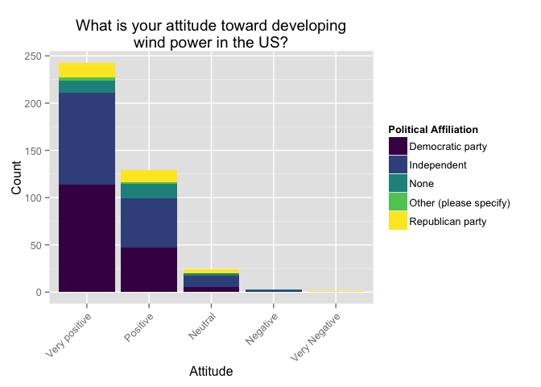
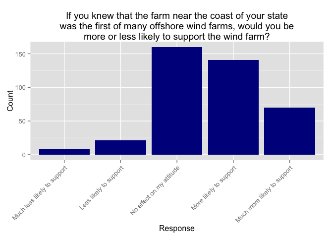

# WF_data_explore
Sarah Klain  
October 14, 2015  


## Wind Farm Data Cleaning and Exploration

### Data Cleaning
I deleted the following columns from my data files.

ResponseSet, Name, ExternalDataReference, EmailAddress, Status

I deleted incomplete surveys.

I made ethnic origin one column. 

I deleted the responses that incorrectly asnwered my "are you paying attnetion questions" Attention filter: if att1 = 0 and att2 = 5 then I deleted the row


```r
library(ggplot2)
library(ggthemes)
library(wesanderson)
library(viridis)
suppressMessages(library(dplyr))
library(knitr)
library(tidyr)
library(broom)
```

load data, c for coded, nc for not coded


```r
c <- read.csv("~/Documents/R_2015/wf_ce/Coded_WF_10_14_2015.csv")
nc <- read.csv("Not_coded_2015_10_20_WF_CE.csv")
```

## Plots of data using demographic variables

Income


```r
nc$income2 <- factor(nc$income, levels=c("Less than $10,000", "$10,000-$14,999","$15,000-$24,999", "$25,000-$34,999", "$35,000-$49,999", "$50,000-$74,999","$75,000-$99,999", "$100,000-$124,999","$125,000-$149,000",
"$150,000-$174,999", "$175,000-$199,999", "$250,000 and above"))

ggplot(data=nc, aes(x=income2, fill = gender)) + 
  geom_bar()+ 
  theme(axis.text.x = element_text(angle = 45, hjust = 1)) +
  scale_fill_viridis(discrete=TRUE) +
  xlab("Income") + ylab("Count")
```

 

```r
ggsave("fig_income.pdf")
```

```
## Saving 7 x 5 in image
```

Education


```r
nc$education2 <- factor(nc$education, levels=c("Grade school", "Some high school","High school graduate", "Some college credit ", "Associate degree", "Bechelor degree", "Graduate degree or Professional degree ", "Professional degree"))
ed <- ggplot(data = nc, aes(x= education2, fill = gender))
ed + geom_bar() + theme(axis.text.x = element_text(angle = 45, hjust = 1)) +
  xlab("Education") + ylab("Count") +
  scale_fill_viridis(discrete=TRUE)
```

 

```r
ggsave("fig_edu.pdf")
```

```
## Saving 7 x 5 in image
```

Employment


```r
ggplot(data=nc, aes(x=employment, fill = gender)) + geom_bar() + 
  theme(axis.text.x = element_text(angle = 45, hjust = 1)) +
  scale_fill_viridis(discrete=TRUE) +
    xlab("Employment") + ylab("Count")
```

 

```r
ggsave("fig_employ.pdf")
```

```
## Saving 7 x 5 in image
```

Political Party Affiliation


```r
pol <- ggplot(nc, aes(x = pol_party, fill = education2))
pol + geom_bar() +
  scale_fill_viridis(discrete=TRUE, "Education", option = "magma") +
  theme(axis.text.x = element_text(angle = 45, hjust = 1)) +
  xlab("Political Party") + ylab("Count") 
```

 

```r
ggsave("fig_employ.pdf")
```

```
## Saving 7 x 5 in image
```

Age


```r
age <- ggplot(nc, aes(x = age, fill = gender))
age + geom_histogram(binwidth = 3) +
  scale_fill_viridis(discrete=TRUE) +
  xlab("Age") + ylab("Count")
```

 

```r
ggsave("fig_age.pdf")
```

```
## Saving 7 x 5 in image
```

Race

I will compare this to census tract data since my sample is *very* white. 


```r
race <- ggplot(c, aes(x = ethnic_or))
race + geom_histogram(binwidth = 3) +
  theme(axis.text.x = element_text(angle = 45, hjust = 1)) +
  xlab("Race") + ylab("Count")
```

 

```r
ggsave("fig_race.pdf")
```

```
## Saving 7 x 5 in image
```

## Opinions

What is your attitude toward developing wind power in the US?

```r
nc$att_w_US2 <- factor(nc$att_w_US, levels=c("Very positive","Positive", "Neutral", "Negative", "Very Negative"))
ed <- ggplot(data = nc, aes(x= nc$att_w_US2, fill = pol_party))
ed + geom_bar() + theme(axis.text.x = element_text(angle = 45, hjust = 1)) +
  xlab("Attitude") + ylab("Count") +
  scale_fill_viridis(discrete=TRUE) +
  ggtitle("What is your attitude toward developing\nwind power in the US?")
```

 

```r
ggsave("fig_att_w_US.pdf")
```

```
## Saving 7 x 5 in image
```

Have you seen a wind turbine in operation?

```r
oper <- ggplot(nc, aes(x = oper))
oper + geom_histogram(binwidth = 3, fill = "green4") +
  xlab("Response") + ylab("Count") +
  ggtitle("Have you seen a wind turbine in operation?")
```

 

```r
ggsave("fig_oper.pdf")
```

```
## Saving 7 x 5 in image
```

In your opinion, construction of offshore wind turbines off the coast of your state should be:
 

```r
nc$const_st2 <- factor(nc$const_st, levels=c("Encouraged", "Tolerated", "Discouraged", "Prohibited", "Not sure"))

constst <- ggplot(nc, aes(x = const_st2, fill = const_st2))
constst + geom_histogram(binwidth = 3) +
  scale_fill_viridis(discrete=TRUE) +
  theme(axis.text.x = element_text(angle = 45, hjust = 1)) +
  xlab("Response") + ylab("Count") +
  ggtitle("In your opinion, construction of offshore\nwind turbines off the coast of your state should be:")
```

 

```r
ggsave("fig_const_st.pdf")
```

```
## Saving 7 x 5 in image
```

Would the presence of a visible offshore wind farm make you more or less likely to go to the coast for recreational purposes (e.g., beach-going, boating, fishing, or walking along the coast)?


```r
nc$wf_rec2 <- factor(nc$wf_rec, levels=c("Much less likely","Less likely", "No difference", "More likely", "Much more likely"))

wfrec <- ggplot(nc, aes(x = wf_rec2))
wfrec + geom_histogram(binwidth = 3, fill = "blue4") +
  theme(axis.text.x = element_text(angle = 45, hjust = 1)) +
  xlab("Response") + ylab("Count") +
  ggtitle("Would the presence of a visible offshore wind farm make you\nmore or less likely to go to the coast for recreational purposes, \ne.g., beach-going, boating, fishing, or walking along the coast?")
```

 

```r
ggsave("fig_const_st.pdf")
```

```
## Saving 7 x 5 in image
```

Imagine that a wind project off your state’s coast was the first of numerous North American offshore wind projects. Would this influence your attitude towards the wind project? For example, suppose that building 200 offshore wind farms could supply 30% of the electricity for New England coastal states. Together, these wind farms would have a substantially larger impact on how people currently use the ocean and the ocean environment than one wind farm. However, 200 wind farms could reduce air pollution and reliance on fossil fuels linked to climate change and sea level rise. If you knew that the farm near your state’s coast was the first of many offshore wind farms, would you be more or less likely to support the wind farm?


```r
nc$first_m2 <- factor(nc$first_of_many, levels=c("Much less likely to support", "Less likely to support", "No effect on my attitude", "More likely to support", "Much more likely to support"))

First_st <- ggplot(nc, aes(x = first_m2))
First_st + geom_histogram(binwidth = 3) +
  theme(axis.text.x = element_text(angle = 45, hjust = 1)) +
  xlab("Response") + ylab("Count") +
  ggtitle("If you knew that the farm near your state’s coast\nwas the first of many offshore wind farms, would you be\nmore or less likely to support the wind farm?")
```

 

```r
ggsave("fig_wf_rec.pdf")
```

```
## Saving 7 x 5 in image
```

```
## Warning in grid.Call(L_textBounds, as.graphicsAnnot(x$label), x$x, x$y, :
## conversion failure on 'If you knew that the farm near your state’s coast'
## in 'mbcsToSbcs': dot substituted for <e2>
```

```
## Warning in grid.Call(L_textBounds, as.graphicsAnnot(x$label), x$x, x$y, :
## conversion failure on 'If you knew that the farm near your state’s coast'
## in 'mbcsToSbcs': dot substituted for <80>
```

```
## Warning in grid.Call(L_textBounds, as.graphicsAnnot(x$label), x$x, x$y, :
## conversion failure on 'If you knew that the farm near your state’s coast'
## in 'mbcsToSbcs': dot substituted for <99>
```

```
## Warning in grid.Call(L_textBounds, as.graphicsAnnot(x$label), x$x, x$y, :
## conversion failure on 'If you knew that the farm near your state’s coast'
## in 'mbcsToSbcs': dot substituted for <e2>
```

```
## Warning in grid.Call(L_textBounds, as.graphicsAnnot(x$label), x$x, x$y, :
## conversion failure on 'If you knew that the farm near your state’s coast'
## in 'mbcsToSbcs': dot substituted for <80>
```

```
## Warning in grid.Call(L_textBounds, as.graphicsAnnot(x$label), x$x, x$y, :
## conversion failure on 'If you knew that the farm near your state’s coast'
## in 'mbcsToSbcs': dot substituted for <99>
```

```
## Warning in grid.Call.graphics(L_text, as.graphicsAnnot(x$label), x$x, x
## $y, : conversion failure on 'If you knew that the farm near your state’s
## coast' in 'mbcsToSbcs': dot substituted for <e2>
```

```
## Warning in grid.Call.graphics(L_text, as.graphicsAnnot(x$label), x$x, x
## $y, : conversion failure on 'If you knew that the farm near your state’s
## coast' in 'mbcsToSbcs': dot substituted for <80>
```

```
## Warning in grid.Call.graphics(L_text, as.graphicsAnnot(x$label), x$x, x
## $y, : conversion failure on 'If you knew that the farm near your state’s
## coast' in 'mbcsToSbcs': dot substituted for <99>
```

```
## Warning in grid.Call.graphics(L_text, as.graphicsAnnot(x$label), x$x, x
## $y, : conversion failure on 'If you knew that the farm near your state’s
## coast' in 'mbcsToSbcs': dot substituted for <e2>
```

```
## Warning in grid.Call.graphics(L_text, as.graphicsAnnot(x$label), x$x, x
## $y, : conversion failure on 'If you knew that the farm near your state’s
## coast' in 'mbcsToSbcs': dot substituted for <80>
```

```
## Warning in grid.Call.graphics(L_text, as.graphicsAnnot(x$label), x$x, x
## $y, : conversion failure on 'If you knew that the farm near your state’s
## coast' in 'mbcsToSbcs': dot substituted for <99>
```

Do you recreate on the coast? This could be a range of coastal or ocean-based activities such as going to the beach, surfing, fishing, and/or boating. 


```r
nc$freq_rec2 <- factor(nc$freq_rec, levels=c("Frequently, 20+ times/year", "Sometimes, 10-20 times/year", "Every now and then, 5-10 times/year", "Rarely, 1-5 times/year", "Never"))

freqrec <- ggplot(nc, aes(x = freq_rec2))
freqrec + geom_histogram(binwidth = 3, fill = "blue4") +
  theme(axis.text.x = element_text(angle = 45, hjust = 1)) +
  xlab("Response") + ylab("Count") +
  ggtitle("Do you recreate on the coast?\nThis could be a range of coastal or ocean-based activities \nsuch as going to the beach, surfing, fishing, and/or boating.")
```

 

```r
ggsave("fig_freq_rec.pdf")
```

```
## Saving 7 x 5 in image
```


## Constructed Means

Input data

```r
cm <- read.csv("~/Documents/R_2015/wf_ce/Constr_means_MT.csv")
cval <- read.csv("Coded_val_10_20_2015.csv")
```

str(cval)
I did exploratory plots of the data


```r
# cval %>% 
  # gather(val_state, ag_dis, abuse_nep:mean_inst)

# cval2 <- tidyr::gather(cval, "val_state", "ag_dis", 3:29)
```
str(cval2)
head(cval2)

ggplot(cval2, aes(x = val_state, y = ag_dis)) +
geom_boxplot(width=.2, outlier.shape = NA, alpha = 0.1)

  geom_point(width=.2, alpha = 0.1)


```r
ggplot(cm, aes(x = type_mean, y = con_mean)) +
  geom_jitter(position = position_jitter(width = 0.04, height = 0), color = "goldenrod1", alpha = 1/5) +
  stat_summary(fun.y = min, colour = "turquoise4", geom = "point", size = 4) +
  stat_summary(fun.y = max, colour = "red3", geom = "point", size = 4) +
  geom_boxplot(width=.2, outlier.shape = NA, alpha = 0.1) +
  xlab("Type of Constructed Mean") + ylab("Mean Level of Agreement, 1 = Strongly Disagree; 5= Strongly Agree")
```

```
## Warning: Removed 41 rows containing missing values (geom_point).
```

```
## Warning: Removed 4 rows containing missing values (geom_point).
```

```
## Warning: Removed 154 rows containing missing values (geom_point).
```

```
## Warning: Removed 4 rows containing missing values (geom_point).
```

```
## Warning: Removed 2 rows containing missing values (geom_point).
```

 

And a squiggly violin plot! 


```r
ggplot(cm, aes(x = type_mean, y = con_mean)) +
  geom_jitter(position = position_jitter(width = 0.04, height = 0), color = "goldenrod1", alpha = 1/5) +
  stat_summary(fun.y = min, colour = "turquoise4", geom = "point", size = 4) +
  stat_summary(fun.y = max, colour = "red3", geom = "point", size = 4) +
  geom_violin(alpha = 0.1) +
  xlab("Type of Constructed Mean") + ylab("Mean Level of Agreement")
```

 
